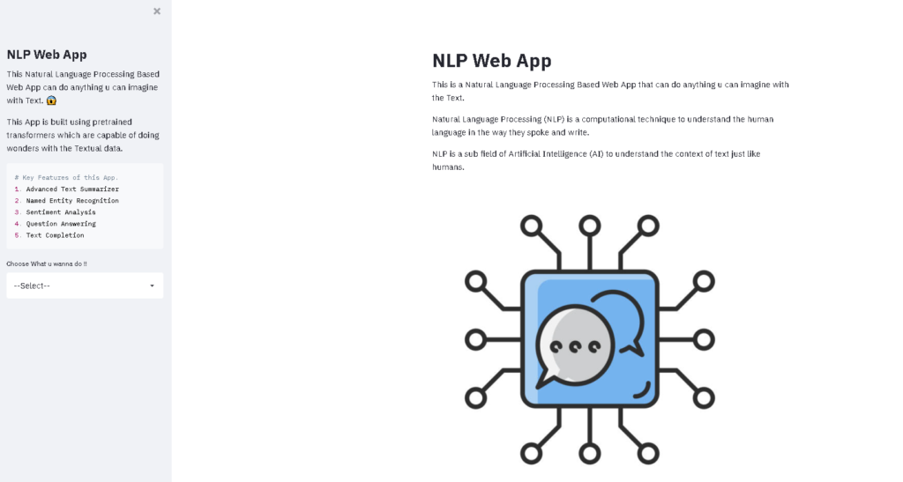

# 📄 DocGen - Document Analyzer with NLP

**DocGen** is an application that enables users to enter custom text and interact with it using advanced NLP techniques. The app provides features like text summarization, sentiment analysis and a conversational interface for an enhanced document understanding experience.

## 🚀 Features

- 📂 **Upload PDFs** and extract relevant information
- 🧠 **Advanced NLP Capabilities**:  
  - ✨ Text Summarization  
  - 🏷️ Named Entity Recognition  
  - 📋 Sentiment Analysis  
  - ❓ Question Answering  
  - ✍️ Text Completion  
- 💬 **Conversational Interface** for interacting with document content





## 🛠 Tech Stack

- **Frontend:** Streamlit 
- **Backend:** Python   
- **NLP Tools:** Hugging Face Transformers, spaCy  


## 📦 Installation

1. 🔁 **Clone the Repository**
   ```bash
   git clone https://github.com/yourusername/DocGen.git
   cd DocGen
   ```

2. 🧪 **Create a Virtual Environment**
   ```bash
   python -m venv venv
   source venv/bin/activate  # Windows: venv\Scripts\activate
   ```

3. 📥 **Install Dependencies**
   ```bash
   pip install -r requirements.txt
   ```

4. 🔑 **Set Up API Keys**
   - Set up API keys for Hugging Face and Google Cloud
   - Use a `.env` file or environment variables to store keys

5. 🚀 **Run the App**
   ```bash
   streamlit run app.py
   ```


## 📌 Use Cases

- 📚 Academic paper analysis  
- 🔍 Contextual search from large textual data  
- 🧾 Business and financial summary extraction  


## 🤝 Contributing

Contributions are welcome! Fork the repo, open issues, or submit pull requests to improve DocGen.
